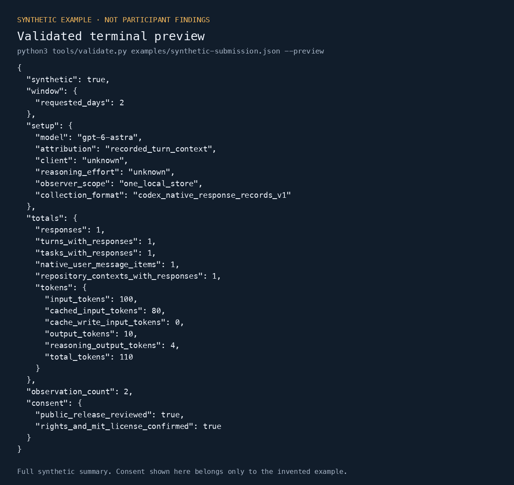
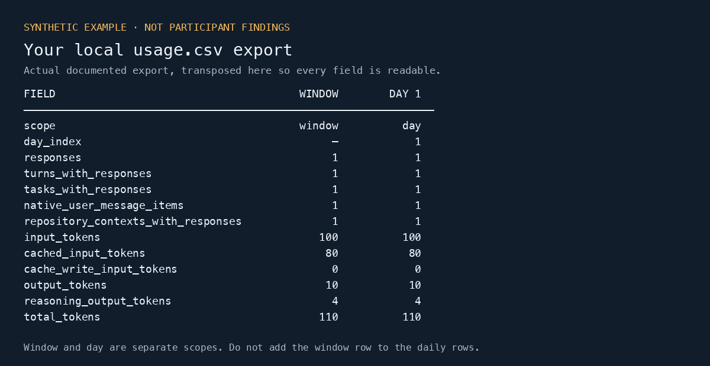

# Astra Field Study

A community kit for studying how coding agents follow instructions in everyday work. The starting point is simple: **this is what I currently think, but I want to know more.** Bring successful experiences, failures, and counterexamples.

Two entirely untested hypotheses motivate the project:

1. Efforts to finish efficiently may sometimes override the intended process or its constraints.
2. Delegation may lose SOP instructions or other requirements between the main agent and its subagents.

These are hypotheses formed from roughly four or five days of personal experience, not conclusions about a model's internal objectives. Efficiency can be useful and fully compliant. It is not itself cheating. Shared bad strategies, missing context, tool failures and unclear instructions are different possible explanations.

Usage counts describe activity. They do not establish SOP adherence, model authorship, productivity gains or either proposed cause. This is an observational project with voluntary, self-selected contributions, no randomized comparison and no account-wide completeness guarantee. The kit examples contain **synthetic data only**. A separate [reviewed real case study](evidence/brad-groux-six-days-v1/README.md) now publishes de-identified aggregate evidence; it is not a participant submission or a raw history export.

## v1.0 resources

- [Six days of GPT-6 Astra: usage and corrective steering](https://go.sstb.ai/astra-study) — the published study, figures, methods, and interactive explorer.
- [From GPT-5.6 Sol to GPT-6 Astra: Why Am I Repeating Myself?](https://go.sstb.ai/astra-blog) — the written account of the workflow and corrective-steering findings.
- [Astra Field Study repository](https://go.sstb.ai/astra-repo) — reviewed aggregates, reproducible tools, and the contribution kit.
- [v1.0 change notes](CHANGELOG.md) — scope, compatibility, and interpretation limits.

## Published observational evidence

[Brad Groux's six-day Astra case study](evidence/brad-groux-six-days-v1/README.md) includes real aggregate evidence, methods, public source context, six exportable figures, and a local interactive reader. The reported finding is that his established GPT-5.6 operating method did not transfer reliably to GPT-6 in his testing and usage. A matched comparative failure rate and both causal explanations remain unmeasured.

The evidence contains 25,254 recorded responses and 538 reviewed substantive contributions, including 147 with corrective steering and 154 with explicit dissatisfaction, with 91 overlapping. These are descriptive counts, not a performance score. Every project and observer is generic; days are relative. The published resources above are the reader-facing entry points. Editorial source and social drafts are maintained in [digitalmeld.io](https://github.com/DigitalMeld/digitalmeld.io/tree/main/docs/drafts/2026-09-09-astra-field-study), outside this evidence repository.

The separate [observational evidence format](docs/observational-evidence-format.md) preserves submission 1.0/1.1 compatibility and the separation of optional direct ratings. Validate the case locally:

```sh
python3 tools/validate_evidence.py evidence/brad-groux-six-days-v1/evidence.json --ready
```

## Try the kit

Python 3.10 or later; standard library only. Run from this checkout:

```sh
python3 -m unittest discover -s tests -v
python3 tools/validate.py examples/synthetic-submission.json --ready --preview
```

To collect your own retained records, first read the [local collection prompt](docs/local-collection-prompt.md) and [privacy rules](docs/privacy.md). Choose your own UTC date range and a **new draft file outside this checkout and your Codex store**. Example dates below are illustrative:

```sh
python3 tools/collect.py --start 2026-09-01 --end 2026-09-02 --model gpt-6-astra --client codex_desktop --out /tmp/astra-draft.json
python3 tools/validate.py /tmp/astra-draft.json --preview
```

The collector reads only local JSONL under `~/.codex/sessions` and `~/.codex/archived_sessions` by default. Use `--home` for another local store. It makes no network requests, never reads SQLite, never modifies source history, and uploads nothing. It exports counts, study-relative day numbers and controlled categories. It does **not** export repository names, paths, prompts, tool output or original record identifiers.

Only the evidenced native `token_usage_record` format with matching `turn_context` is supported. Older clients that only retain cumulative `token_count` snapshots cannot be measured by this collector. Unsupported, incomplete or conflicting evidence is rejected rather than estimated. See [metric definitions and format limits](docs/methodology.md).

## View and export your own results

Use the [local viewing and export guide](docs/local-results.md) to read a terminal summary, save complete JSON, and create CSV files for your own spreadsheet. It includes worked synthetic examples and optional rating summaries. Private viewing does not require public-release consent or a submission. The published study explorer displays the separate case study, not participant files.

## Example prompts

Paste these into a local coding assistant opened in this checkout. Replace `START_DATE`, `END_DATE`, `DRAFT_PATH`, and `OUTPUT_DIRECTORY` before using your own data. Dates are inclusive UTC days; use new output paths outside this checkout and your Codex store.

### Try the synthetic example first

```text
Read AGENTS.md and docs/local-results.md. Run the terminal preview for
examples/synthetic-submission.json, then execute the documented JSON/CSV
export recipe with that synthetic input and a new temporary directory.
Show me the summary and usage table, identify the outputs, and explain
window versus daily counts and token subsets. Use only the synthetic
example; do not read my session history, install anything, or upload files.
```

### Collect my own records privately

```text
Read AGENTS.md, docs/local-collection-prompt.md, docs/privacy.md, and
CONTRIBUTING.md. Collect my own retained Codex records from START_DATE
through END_DATE for gpt-6-astra into a new file at DRAFT_PATH. Keep client
and reasoning effort unknown unless I specify them. Use the supported
collector only, leave both consent fields false, and validate and show the
local preview. Do not read SQLite, change source history, expose raw text
or identifiers, infer observations or ratings, or publish anything.
If the retained format is unsupported, report that limitation and stop.
```

### Export and view my existing aggregate

```text
Read AGENTS.md and docs/local-results.md. Validate my aggregate at
DRAFT_PATH without --ready, then use the documented recipe to create
aggregate.json, summary.json, usage.csv, and observations.csv in the new
OUTPUT_DIRECTORY. Keep consent unchanged. Show the summary and a readable
usage table. If actual ratings are present, show their summaries separately
by timing group and preserve missing values. Do not infer ratings or use
the fixed case-study explorer as an importer. Keep everything local; do
not submit, upload, overwrite earlier exports, or install dependencies.
```

## Example outputs

These images render **actual output from the checked-in synthetic example**. They are not participant findings or screenshots of a hosted dashboard. Your values depend on your retained records. All of the data shown remains available as selectable JSON or CSV through the [local export guide](docs/local-results.md).

### Terminal preview



*The full `--preview` output from `examples/synthetic-submission.json`: one response, 100 input tokens, 80 cached input tokens, and 10 output tokens. The true consent values belong to this invented fixture; private collection leaves your consent false.*

### CSV for your own spreadsheet



*The documented recipe's actual `usage.csv`, transposed for readability. Window and day rows are separate scopes. Cached input and reasoning output are subsets, not extra tokens to add. The guide also exports the complete aggregate, summary, and observation categories.*

[Image sources and regeneration](docs/images/README.md).

## Optional direct ratings

Keep measured activity, coded observations, and participant ratings separate. The optional [task satisfaction and ease protocol](docs/self-reported-ratings.md) adds actual 1–5 satisfaction and 1–7 SEQ answers, with explicit missingness and invitation coverage. Immediate responses and later recollection are reported separately. The collector never infers ratings, and there is no blended quality index.

```sh
python3 tools/validate.py examples/synthetic-ratings-submission.json --ready --preview
```

[Schema 1.1](schema/submission-v1.1.schema.json) adds this optional layer; existing 1.0 submissions remain valid and unchanged. Both examples contain invented data only.

## Participate

**To submit your findings:** follow the [step-by-step contribution guide](CONTRIBUTING.md), then open a pull request to `main` with one reviewed aggregate JSON file in [`submissions/`](submissions/README.md). There is no automatic upload or hosted submission form. Keep collection drafts local until full review and explicit consent.

Use [Discussions](https://github.com/BradGroux/astra-field-study/discussions) for questions and contradictory experiences. Successful adherence examples are as useful as deviations. If a useful observation does not fit the controlled categories, propose a schema change with a synthetic example; do not add private narrative to a submission.

The versioned [schema](schema/submission-v1.schema.json), [synthetic example](examples/synthetic-submission.json) and local checks make contributions inspectable. De-identified payloads are not anonymous participation: GitHub pull requests expose the contributor account and commit metadata, and activity patterns can identify people. These checks do not guarantee anonymity or remove the need to review disclosure and permissions. Never upload Codex session history or databases, even when asking for troubleshooting help.

All validation runs locally. This repository has no GitHub Actions, connected CI, or CI merge requirement.

## License

Original project code, documentation and contributed datasets are licensed under [MIT](LICENSE), copyright Brad Groux 2026 for the initial project. Contributors retain their rights and license their original contributions under MIT. Reuse requires preserving applicable copyright and permission notices; it does not require promotional credit or a link. Linked third-party papers, tweets, articles and vendor documentation retain their own terms and are not relicensed by this repository.
